# 📧 Firebase Email Verification with Postman

## Overview
Dokumentasi ini menjelaskan implementasi verifikasi email menggunakan Firebase Authentication dan pengujian API menggunakan Postman.

---

## 1. Setup Firebase Project

Langkah pertama adalah membuat project baru di Firebase Console.

1. Buka https://console.firebase.google.com
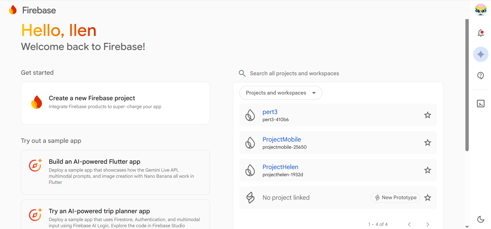
2. Klik **Add Project**
3. Masukkan nama project
4. Klik **Continue** sampai selesai
---

### Tampilan pembuatan project

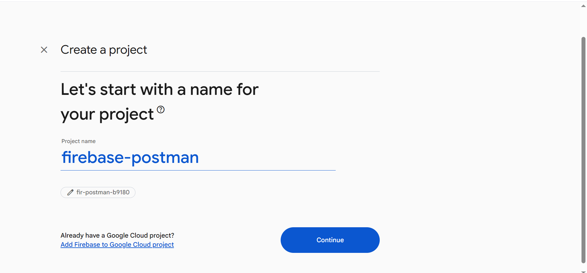

---

Setelah project berhasil dibuat, kita akan diarahkan ke dashboard Firebase.

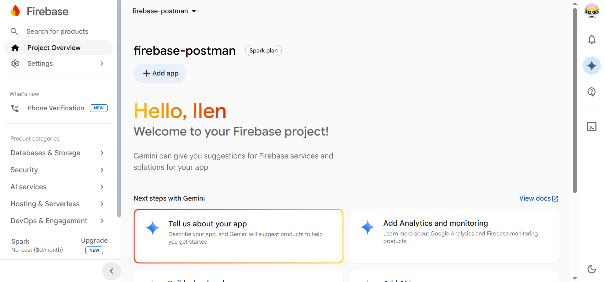

---

# 2. Enable Authentication

Aktifkan fitur Firebase **Authentication**.

Langkah-langkahnya:

1. Pada sidebar Firebase klik **Build**
2. Pilih menu **Authentication**
3. Klik **Get Started**

---

### Menu Authentication

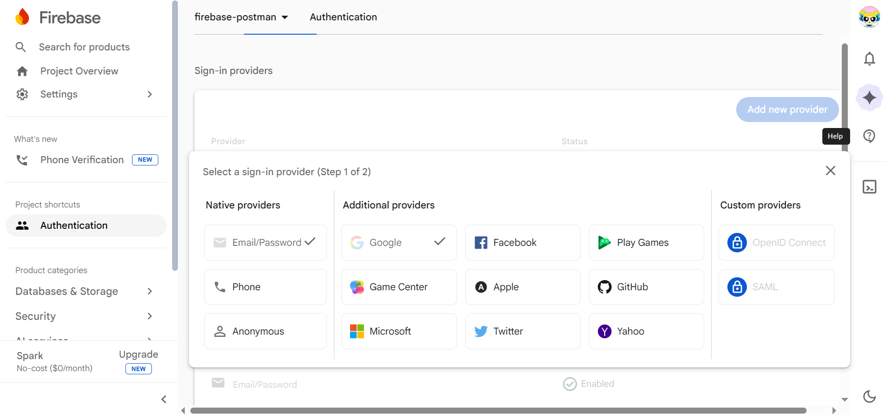

---

Setelah itu kita harus mengaktifkan metode login **Email/Password** dan **Google**.

Langkahnya:

1. Masuk ke tab **Sign-in Method**
2. Klik **Email/Password**
3. Aktifkan **Enable**
4. Klik **Save**
4. Setelah itu Klik **Add New Provider** dan Pilih Menu/Logo **Google**

---

### Enable Email Password

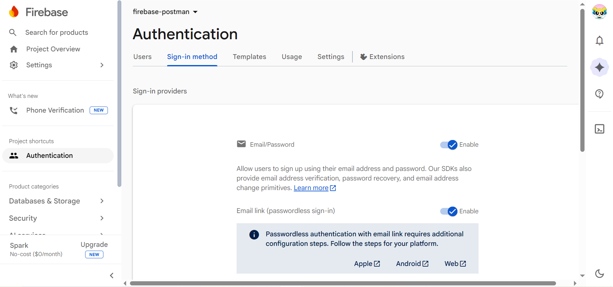

### Enable Google

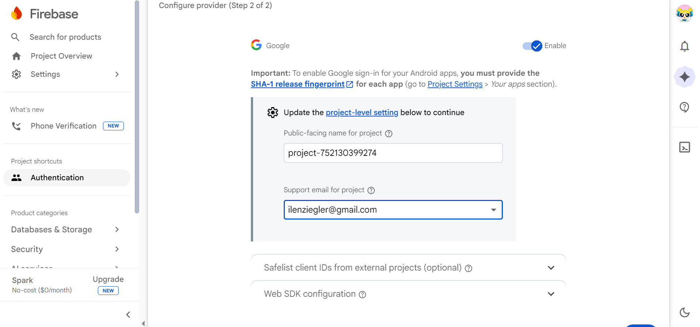

### Pastikan Authentication Semua Sudah Enable

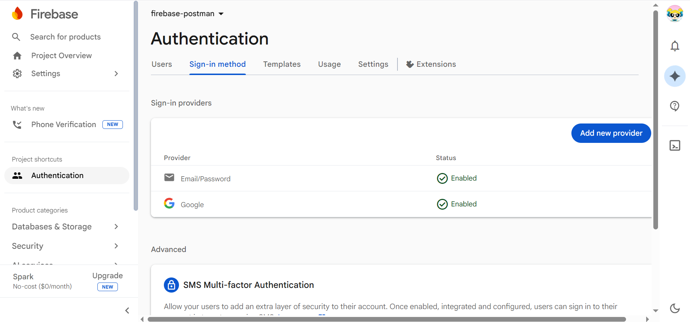

---

# 3. Mendapatkan Firebase API Key

Untuk menggunakan Firebase API melalui Postman, kita memerlukan **API Key**.

Langkah-langkah:

1. Klik **Project Settings**
2. Masuk ke tab **General**
3. Scroll ke bagian **Your Apps**

---

### Firebase Project Settings

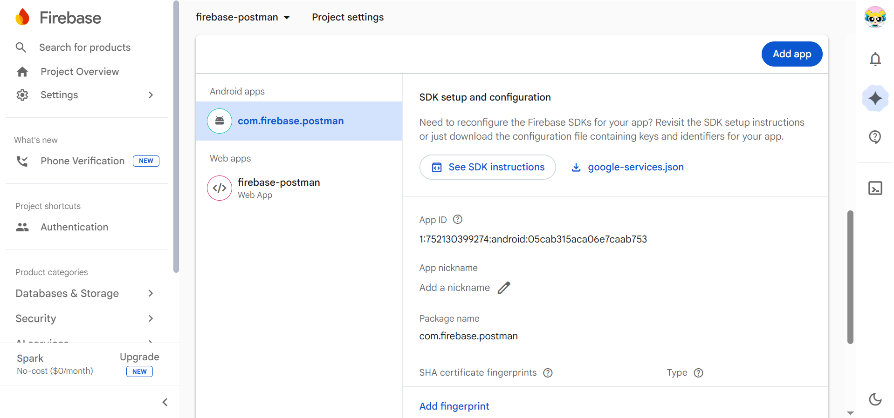

---

Kemudian salin atau simpan nilai:

API Key ini akan digunakan pada request Postman.

---

## 4. Setup Postman Environment

Buka aplikasi Postman dan buat environment baru.

Contoh variable:

| Variable | Value |
|--------|------|
| FIREBASE_API_KEY | API key dari Firebase |
| ID_TOKEN | token dari login |

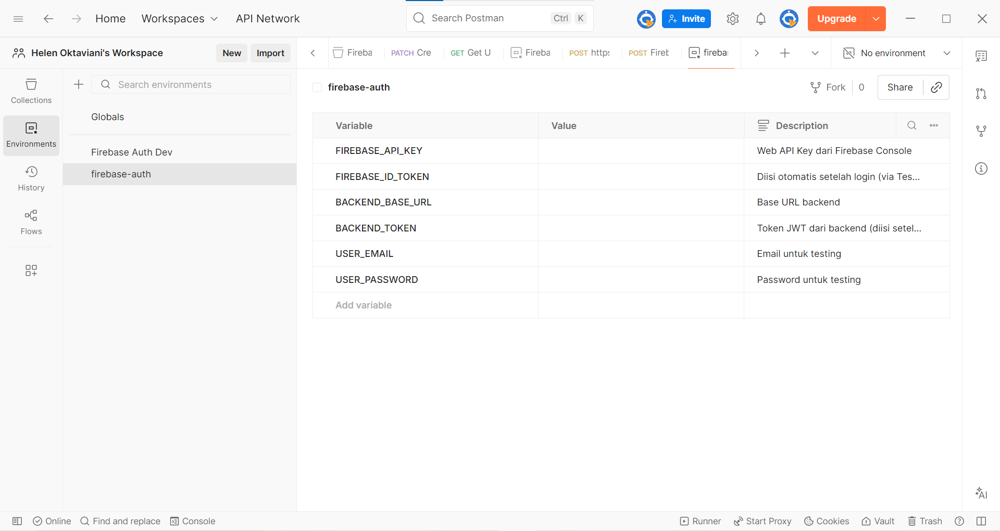

---

## 5. Register User via Firebase API

Endpoint:

POST https://identitytoolkit.googleapis.com/v1/accounts:signUp?key={{FIREBASE_API_KEY}}

### Body Request

{
 "email":"user@email.com",
 "password":"12345678",
 "returnSecureToken":true
}

### Postman Headers

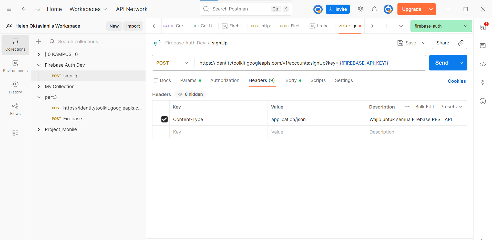

### Postman Body (raw JSON)

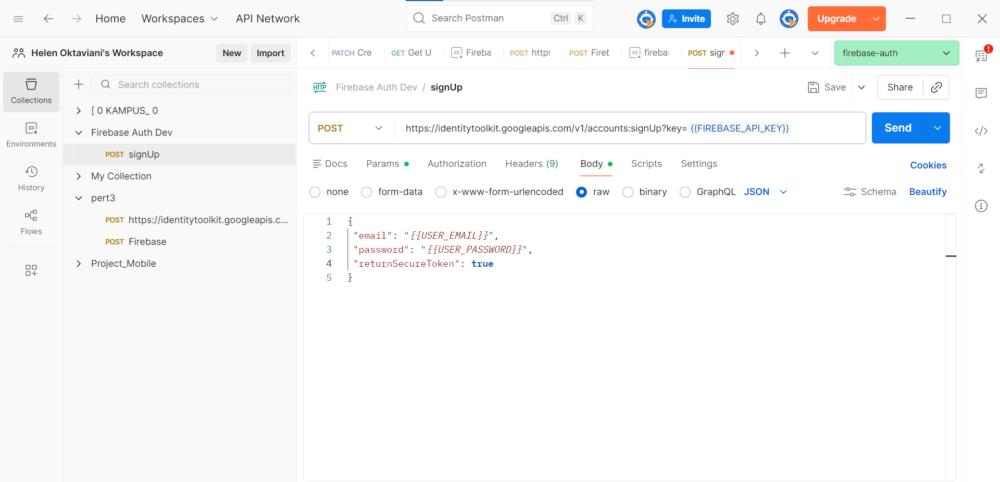

### Scripts

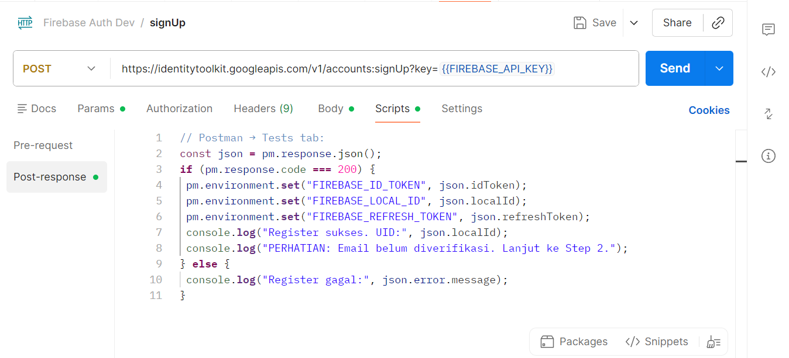

### Jika sudah, coba test Send dan lihat hasilnya dengan Beberapa Kemungkinan
1. 

<b>200 OK - Request Berhasil</b>
Request berhasil diproses oleh Firebase Authentication.  
User berhasil dibuat dan Firebase mengembalikan response berupa token autentikasi seperti <b>idToken</b>, <b>refreshToken</b>, dan <b>expiresIn</b>.
Artinya proses registrasi atau login berjalan dengan sukses.

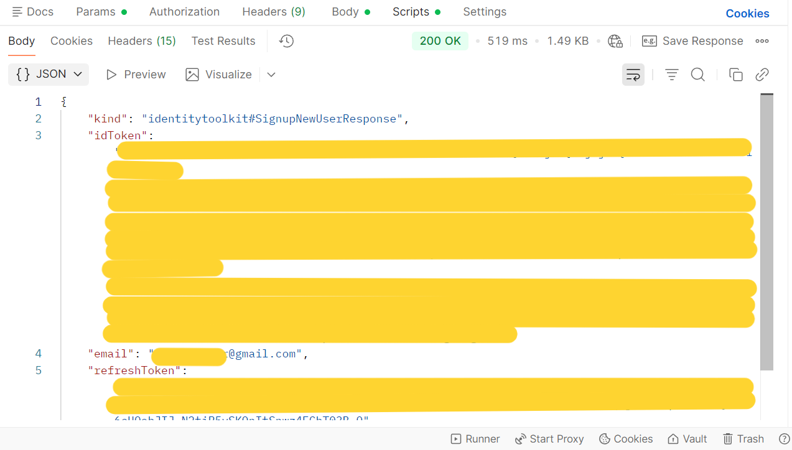

---
2. 

<b>400 Bad Request - Request Gagal</b>

Request gagal diproses oleh Firebase.  
Hal ini biasanya terjadi karena beberapa kemungkinan seperti: Email sudah terdaftar

Periksa kembali request yang dikirim melalui Postman.

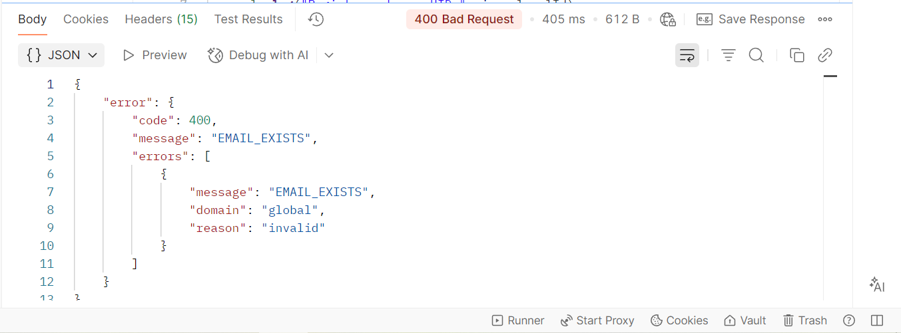

---

## 6. Send Email Verification

Endpoint:

POST https://identitytoolkit.googleapis.com/v1/accounts:sendOobCode?key={{FIREBASE_API_KEY}}

### Body Request

{
 "requestType":"VERIFY_EMAIL",
 "idToken":"{{ID_TOKEN}}"
}

### Body

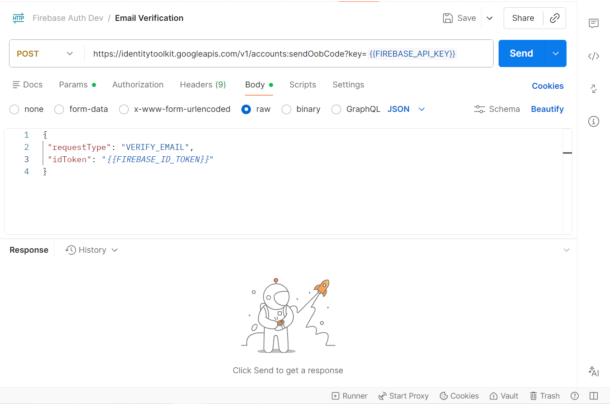

### Verify Success

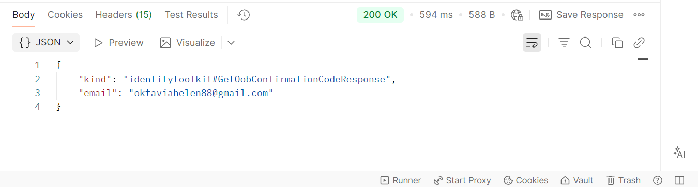

